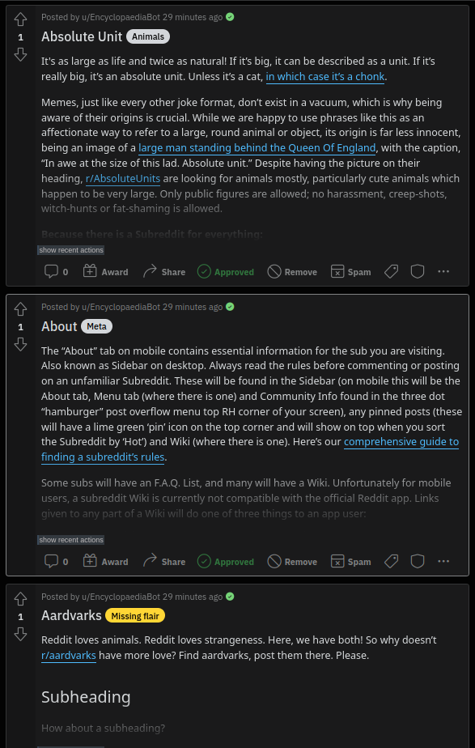

# EncyclopaediaBot


A reddit bot for r/EncyclopaediaOfReddit to provide a post-based wiki. The bot
automates the creation of and edits of posts based on the wiki to enhance reddit
mobile user experience while browsing this post-based wiki. This bot is part of
the r/NewToReddit network and managed by u/Khyta.

# Example

The bot is currently running on r/EncyclopaediaOfReddit. Here is an extract of a
wiki and the corresponding posts created by the bot.




# Installation

This script has been tested on an Ubuntu 22.04.1 LTS machine with Python 3.10.6.
## Requirements

- Python `3.10.+`
- `praw`
- `sys`
- `os`
- `re`
- `time`
- `csv`
- `pandas`
- `numpy`
- `hashlib`
- `dotenv`

## Quick Setup

1. Clone the repository to your machine.
2. Create a `.env` file in the root directory of the project.
3. Fill out the `.env` file with the credentials from your reddit bot account.
   (See [here](https://www.reddit.com/prefs/apps) for where to find these)
4. Add your subreddit name where you want to run the bot to the `script.py` file.
5. Run the script with `python3 script.py` from your terminal.

# Usage

## Structure of the wiki

It is of utmost importance that the wiki is structured in a specific way. The
bot will not work otherwise. The wiki should be structured as follows:

```
#Heading
::flair_text::

Here is some filler text that will be used as the post's selftext. The h1 heading will be converted to the post's title.

## Subheading

Here is some more filler text. Subheadings are optional and will be converted one level down to create the right formatting.

- h2 -> h1
- h3 -> h2
- h4 -> h3
- etc.

#Other heading for new post
::flair_text::

The flair text has to come directly after the h1 heading. This flair text will determine the flair used for the post.
```

- The flair after the h1 heading is optional. If no flair is specified, the bot
will flair the post with a 'Missing flair' flair. 
- The bot will also create the flairs that are used in the wiki if they do not
exist yet in the subreddit.
- It is important that there is **no** space between the `#` and the heading text.
- It is also important that the `::flair_text::` comes directly after the h1
  heading.

## Limitations

The following limitations are planned to be fixed in the future.

- [ ] Currently, the user has to specify which wiki page to use for the bot to work.
It is planned to automate this process in the future and include a command to
exclude specific wiki pages from the bot. 
- [x] The bot currently does not check for duplicate posts and wiki edits.
- [ ] The bot does not throw an error via modmail or other reddit specific
  communications if something goes wrong.
- [ ] The bot does not make periodic posts and has to be started manually.
- [ ] The links between wikis are currently not translated to links between
  posts.
  

# Credits

Without these wonderful people, this project would not have been possible.

- The [r/NewToReddit](https://www.reddit.com/r/NewToReddit/) mod team for the support and motivation.
- [u/SolariaHues](https://www.reddit.com/user/SolariaHues) for helping to overcome limitations and testing the
  bot.
- [u/Nugget_MacChicken](https://www.reddit.com/user/Nugget_MacChicken) for technical support and ideas.
- [LarsZauberer](https://github.com/LarsZauberer) on GitHub for technical support and ideas.