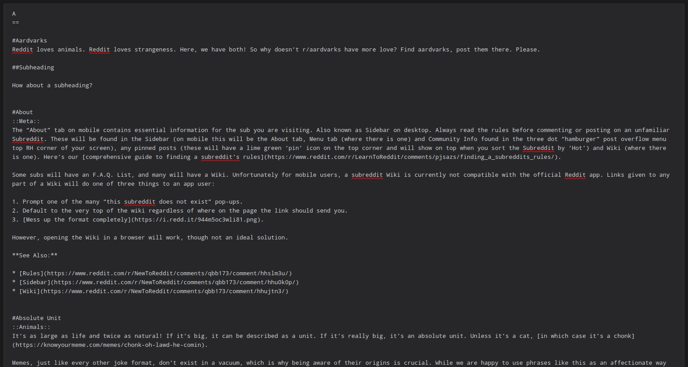

# EncyclopaediaBot


A reddit bot for r/EncyclopaediaOfReddit to provide a post-based wiki. The bot
automates the creation of and edits of posts based on the wiki to enhance reddit
mobile user experience while browsing this post-based wiki. This bot is part of
the r/NewToReddit network and managed by u/Khyta.

# Example

The bot is currently running on r/EncyclopaediaOfReddit. Here is an extract of a
wiki and the corresponding posts created by the bot.




# Installation

This script has been tested on an Ubuntu 22.04.1 LTS machine with Python 3.10.6.
## Requirements

- Python `3.10.+`
- `praw`
- `sys`
- `os`
- `re`
- `time`
- `dotenv`

## Quick Setup

1. Clone the repository to your machine.
2. Create a `.env` file in the root directory of the project.
3. Fill out the `.env` file with the credentials from your reddit bot account.
   (See [here](https://www.reddit.com/prefs/apps) for where to find these)
4. Run the script with `python3 script.py` from your terminal.

# Usage

## Structure of the wiki

It is of utmost importance that the wiki is structured in a specific way. The
bot will not work otherwise. The wiki should be structured as follows:

```
# Heading
::flair_text::

Here is some filler text that will be used as the post's selftext. The h1 heading will be converted to the post's title.

## Subheading

Here is some more filler text. Subheadings are optional and will be converted one level down to create the right formatting.

- h2 -> h1
- h3 -> h2
- h4 -> h3
- etc.

# Other heading for new post
::flair_text::

The flair text has to come directly after the h1 heading. This flair text will determine the flair used for the post.
```

## Limitations

The following limitations are planned to be fixed in the future.

- Currently, the user has to specify which wiki page to use for the bot to work.
It is planned to automate this process in the future and include a command to
exclude specific wiki pages from the bot. 
- The bot currently does not check for duplicate posts and wiki edits.
- The bot does not throw an error via modmail or other reddit specific
  communications if something goes wrong.
- The bot does not make periodic posts and has to be started manually.